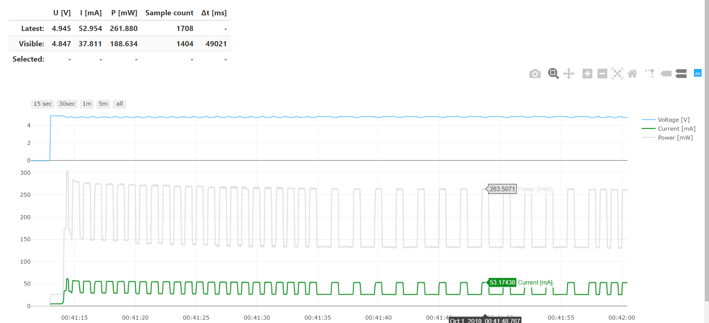

# BLEnergyGraphs
A Bluetooth Low Energy / Web Bluetooth tool to measure the energy needs of your embedded projects!

[Intro blog post](https://www.hackster.io/akos-lukacs/blenergygraphs-7e7b9c)

[Try it](https://akoslukacs.github.io/BLEnergyGraphs/webble/)

# Directory structure

## espruino

Contains the [Espruino](https://www.espruino.com/) code, upload this code before connecting to it.

## webble

Contains web bluetooth code running in the browser.

### Development
For development, serve the html page in the `webble` directory with any simple http server.
There is [this big list of http static server one-liners](https://gist.github.com/willurd/5720255) if you don't have a prefered one.

# Browser support
On desktops currently only Chrome, and the Chromium based Edge supports Web Bluetooth. Should work on all platforms (Mac, Windows 10+, Linux)
On Android tested with Chrome and Vivaldi browser: BLE works, but screen size is screen size...
